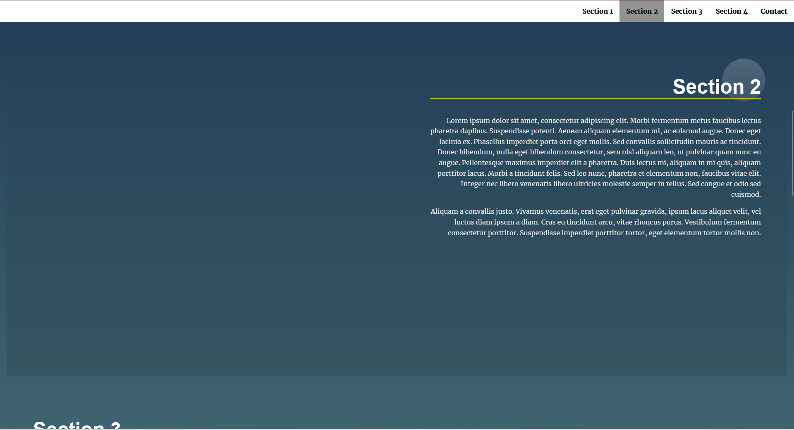

# Landing Page Project

## Table of Contents

* [GitHub-Repository](#githubRepository)
* [Demo of Project](#demoOfProject)
* [Project Name](#projectName)
* [Project Description](#projectDescription)
* [Technologies](#technologies)

## GitHub-Repository
[LandingPage-GithubRepo](https://github.com/HaYaDa/landing-pagev2-master)
---
## Demo of Project
[Landing Page - Github Page](https://hayada.github.io/landing-pagev2-master/)
---
## Project Name
**Project:Landing Page ( Masterschool Web Development Nanodegree Program - 5. CSS, Website Layout, Website Components )** 
---
## Project Description
**Project Summary**

Adding functionality && Content per JavaScript, in detail: https

### Dynamically builded Navigation-Menu && links
- grab HTML-Elements per JavaScript
- create HTML-Elements per JavaScript
- add & remove classes per JavaScript 
---

### Detecting the content in the viewport & functionality 
- detecting which section is in Viewport and highlight the section and related Navigation-Link in the JS-generated Navigation-Bar
---

### Scrolling to related Section's
- Smooth-Scroll functionality added: per Javascript-BuiltIn-Method scrollIntoView(), scroll to related section's/content per klick in the Navigation-Bar
---

### Toogle active class/state
- adding and removing(toggling) active class per JavaScript to HTML-Elements
---

<!-- This project aims to give us **real-world scenarios of manipulating the DOM**. The functionality we will be using serves two purposes: to prepare us for *appending dynamically added data to the DOM*, and to show us *how javascript can improve the usability* of an otherwise static site. This project barely touches the surface of what is possible, but it does use some incredibly common events, methods, and logic. -->

**Technologies**
In this project I use:  
- HTML
- CSS
- JavaScript

